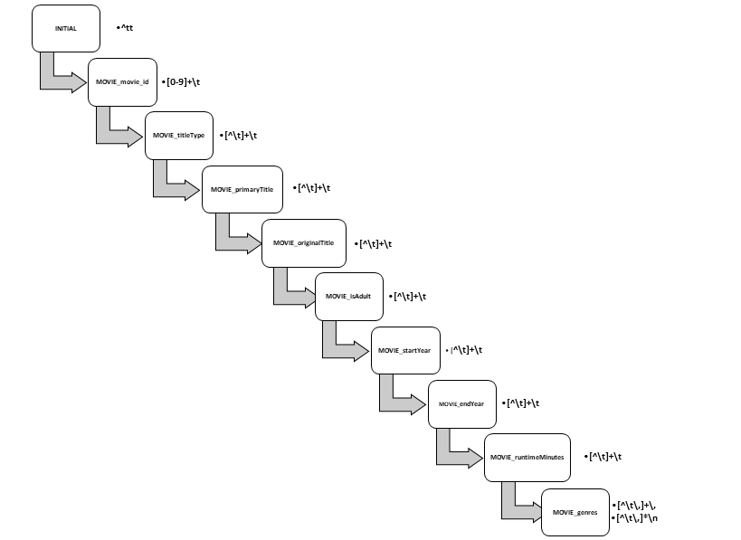
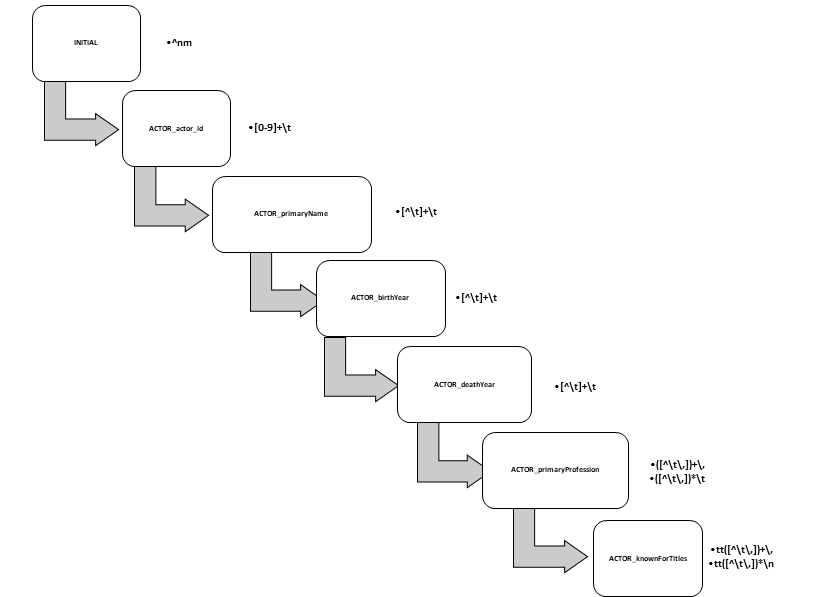

# Trabalho Prático de PL

O presente software foi desenvolvido no contexto académico e deve ser utilizado sem qualquer garantia por conta e risco do utilizador. 

[](https://travis-ci.com/nargotik/PL)

**Autores:** 
- José Moura <a13742@alunos.ipca.pt>
- Óscar Silva <a14383@alunos.ipca.pt>
- Daniel Filipe <a17442@alunos.ipca.pt>

## Introdução
Para a realização deste trabalho foram utilizadas as ferramentas abaixo descritas:
- flex (versão 2.6.0)
- libsqlite3-dev
- sqlite3 (Opcional) 

Utilizamos uma motor de base de dados simples (sqlite) de forma a importar toda a informação contida no ficheiro de teste 
para a base de dados e poder efectuar consultas de qualquer informação directamente na base de dados.

## Requisitos
Libs necessárias instalação em Ubuntu (pode variar com outras distribuições)
```shell script
apt-get install libsqlite3-dev
```
Existe a necessidade de, pelo menos, 2Gb de memoria RAM para processar o ficheiro de teste fornecido pelo professor.
## Utilização / Compilação
Para compilar as aplicações necessárias simplesmente é necessário efectuar o comando:
```shell script
$ make
```

Para efectuar a importação do ficheiro fornecido utilizamos o comando abaixo.
```shell script
utilizador@lesi-ipca:~/PL$ ./bin/import < test_file.tsv
[...]
Comment Detected: ### tconst    titleType       primaryTitle    originalTitle   isAdult startYear       endYear runtimeMinutes  genres
[...]
Inserts Movies  Actors
[...]
Comment Detected: ###  nconst   primaryName     birthYear       deathYear       primaryProfession       knownForTitles
[...]
.\N\N\N\N\N...
[...]
 Movies:6223386 
 Actors:9626431 
utilizador@lesi-ipca:~/PL$ ls -lah
[...]
-rw-r--r--  1 utilizador  utilizador       3,1G out 23 23:28 database.db
[...]
utilizador@lesi-ipca:~/PL$
```

Para efectuarmos a listagem do pedido apenas teremos de executar a aplicação display como mostrado abaixo:

```shell script
utilizador@lesi-ipca:~/PL$ ./bin/display
Showing info from database

* Chris Bailey
* Daniel Torres
         - Walkin' the Way
* David Jewell
* Jennifer Watkins
         - Go Time!
         - Mark
* Jesús Daniel Torres
* Julia Lawson
         - Hlala Kwabafileyo
         - Triptiek II
* Oscar Silva
* Reggie Bush
         - Bad Jokes
         - Simms & Lefkoe: The Show
         - Walking on Dead Fish
* Shiela Martin
* Stefania Zadra
* Ursula Gehrmann
utilizador@lesi-ipca:~/PL$ 
```
Após testes feito em uma máquina virtual Ubuntu com 8Gb de RAM verificamos que o tratamento do ficheiro fornecido pelo professor e colocação desses dados em base de dados demorou:
- Filmes - 4 Minutos
- Actores - 20 Minutos


## Estrutura de flex

### Extração de Filmes



O reconhecimento dos dados referentes a filmes e séries do ficheiro de testes fornecido pelo professor faz-se através prefixo **tt** sendo este seguido por uma sequência finita de algarismos e a cada *tabulação* é encontrada uma característica referente ao filme (p.ex. título, se é para adultos, etc).

Inicialmente, para reconhecer no ficheiro os dados referentes a filmes e séries foi usada a expressão **^tt** que permite identificar, irrevogavelmente que aquela string possui dados referentes a filmes e séries.
Após reconhecer-la é necessário identificar dentro da string os diversos dados que caracterizam o filme. Para tal foi definido o seguinte bloco de instruções com a finalidade ajudar a identificar os dados referentes ao filme.

```c
    nr_movies++;
    tmp_movie.movie_id = "";
    tmp_movie.titleType = "";
    tmp_movie.primaryTitle = "";
    tmp_movie.originalTitle = "";
    tmp_movie.isAdult = 0;
    tmp_movie.startYear = 0;
    tmp_movie.endYear = 0;
    tmp_movie.runtimeMinutes = 0;
```
Após a iniciação dessas variáveis, é necessário entrar num modo que permita reconhecer padrões apenas sobre a string reconhecida acima. Para tal usa-se o comando **BEGIN(MOVIE_x)** sendo x substituído pelo campo que pretendemos reconhecer.

O primeiro dado a reconhecer é o ID do filme. Para tal foi usada a expressão **[0-9]+\t** que permite reconhecer a cadeia de algarismos que são precedidas por tt e que terminam numa tabulação.
Após esse reconhecimento, segue-se um BEGIN que permite reconhecer qual o tipo de conteúdo (p. ex. Filme, série, etc).
O reconhecimento desse dado é obtido através da expressão **[^\t]+\t**. Essa expressão permite identificar que, entre a tabulação reconhecida pela expressão anterior até à próxima tabulação, o dado reconhecido será o que identifica o tipo de conteúdo.

Analogamente ao que foi definido para o campo que identifica o tipo de conteúdo, os restantes campos a reconhecer seguem a mesma expressão de reconhecimento, no entanto, a identificação do campo género carece de uma ligeira alteração na expressão.

@TODO - Não sei explicar a regex [^\t\,]+\, e [^\t\,]*\n

---
### Extração de Actores



O reconhecimento dos dados referentes a actores do ficheiro de testes fornecido pelo professor faz-se através prefixo **nm** sendo este seguido por uma sequência finita de algarismos e a cada *tabulação* é encontrada uma característica referente ao actor (p.ex. nome, data de nascimento e falecimento, etc).

Inicialmente, para reconhecer no ficheiro os dados referentes a actores foi usada a expressão **^nm** que permite identificar, irrevogavelmente que aquela string possui dados referentes a actores.
Após reconhecer-la é necessário identificar dentro da string os diversos dados que caracterizam o actor. Para tal foi definido o seguinte bloco de instruções com a finalidade ajudar a identificar os dados referentes ao actor.

```c
    nr_actors++;
    tmp_actor.actor_id = "";
    tmp_actor.primaryName = "";
    tmp_actor.birthYear = 0;
    tmp_actor.deathYear = 0;
```
Após a iniciação dessas variáveis, é necessário entrar num modo que permita reconhecer padrões apenas sobre a string reconhecida acima. Para tal usa-se o comando **BEGIN(ACTOR_x)** sendo x substituído pelo campo que pretendemos reconhecer.

O primeiro dado a reconhecer é o ID do actor. Para tal foi usada a expressão **[0-9]+\t** que permite reconhecer a cadeia de algarismos que são precedidas por nm e que terminam numa tabulação.
Após esse reconhecimento, segue-se um BEGIN que permite reconhecer qual o nome do actor.
O reconhecimento desse dado é obtido através da expressão **[^\t]+\t**. Essa expressão permite identificar que, entre a tabulação reconhecida pela expressão anterior até à próxima tabulação, o dado reconhecido será o que identifica o nome do actor.
Analogamente ao que foi definido para o campo que identifica o nome do actor, os campos data de nascimento e de falecimento serão reconhecidos através da mesma expressão de reconhecimento, no entanto, a identificação do campo profissão principal e títulos pelos quais são reconhecidos carecem de uma ligeira alteração na expressão.

@todo - Não sei explicar a regex [^\t\,])+\, [^\t\,])*\t [^\t\,])*\n

---

## Estrutura de Base de dados:
```sql
DROP TABLE IF EXISTS movies;
CREATE TABLE movies (
    movie_id TEXT PRIMARY KEY,
    titleType TEXT NOT NULL,
    primaryTitle TEXT NOT NULL,
    originalTitle TEXT NOT NULL,
    isAdult INTEGER NOT NULL,
    startYear INTEGER NOT NULL,
    endYear INTEGER NOT NULL,
    runtimeMinutes INTEGER NOT NULL
);

DROP TABLE IF EXISTS movies_genres;
CREATE TABLE movies_genres (
    movie_id TEXT,
    genre TEXT,
    PRIMARY KEY (movie_id , genre)
);

DROP TABLE IF EXISTS actors;
CREATE TABLE actors (
    actor_id TEXT PRIMARY KEY,
    primaryName TEXT NOT NULL,
    birthYear INTEGER NOT NULL,
    deathYear INTEGER NULL
);
CREATE INDEX idx_name ON actors (primaryName);

DROP TABLE IF EXISTS actors_profession;
CREATE TABLE actors_profession (
    actor_id TEXT,
    profession TEXT,
    PRIMARY KEY (actor_id , profession)
);

DROP TABLE IF EXISTS actors_movies;
CREATE TABLE actors_movies (
    actor_id TEXT,
    movie_id TEXT,
    PRIMARY KEY (actor_id , movie_id )
);
```

## Conclusão
Podemos mostrar desta forma a importância das expressões regulares e aplicações do 
género do flex pois conseguimos tratar de um enorme ficheiro com 18 milhões de registos e colocar numa base de dados para tratamento posterior e armazenamento dos dados.

Hoje em dia cada vez mais há necessidades de migração de sistemas antigos ou de dados para sistemas organizados do género de bases de dados e podemos utilizar esta ferramenta flex como outras ferramentas que utilizem expressões regulares.

Assim sendo tarefas como data minning podem ser muito utilizadas com o uso de expressões regulares.

Abaixo mostramos alguns exemplo de dados complexos que podemos retirar depois de ter a informação normalizada.

#### Exemplos de extração de dados:
Se quisermos saber o número de actores que participaram em filmes de drama realizados em 2012
Bastará correr esta Query SQL.
```sql
SELECT Sum(filmes) 
FROM   ( 
                SELECT   Count(*) AS filmes 
                FROM     movies, 
                         movies_genres, 
                         actors, 
                         actors_movies 
                WHERE    actors_movies.movie_id = movies.movie_id 
                AND      actors.actor_id = actors_movies.actor_id 
                AND      movies.movie_id = movies_genres.movie_id 
                AND      movies_genres.genre = "drama" 
                AND      movies.startyear = 2012 
                GROUP BY actors.actor_id) a;
```


## Bibliografia
- [GitHub Flex](https://github.com/westes/flex)

